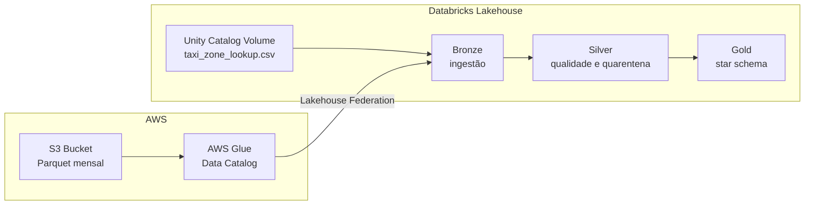

# NYC Yellow Taxi — Engenharia de Dados no Databricks

Projeto de estudo de engenharia de dados que implementa uma arquitetura Lakehouse para os dados de viagens do **NYC Yellow Taxi**. O fluxo utiliza AWS, Unity Catalog e Lakeflow Declarative Pipelines para conduzir os dados desde a ingestão até um modelo dimensional na camada Gold.

O escopo deste documento termina na disponibilização dos assets Gold. A construção de Metric Views, integração com Power BI e configuração do Genie compõem a etapa semântica posterior.

## Objetivos de engenharia

- Integrar dados armazenados na AWS sem copiar desnecessariamente os arquivos de viagens.
- Governar fontes, volumes, tabelas e permissões por meio do Unity Catalog.
- Preservar os dados de origem na camada Bronze.
- Aplicar qualidade, padronização e quarentena na camada Silver.
- Disponibilizar um star schema na camada Gold, preparado para consumo analítico.
- Manter rastreabilidade entre origem, transformações e assets publicados.
- Utilizar apenas Python, Spark e PySpark nas transformações, com `pyspark.sql.functions` importado como `f`.

## Visão geral da arquitetura

O fluxo possui duas entradas independentes:

1. Os arquivos mensais de viagens permanecem no Amazon S3 e são descobertos pelo AWS Glue Data Catalog. O Databricks consulta essas tabelas utilizando Lakehouse Federation.
2. O arquivo de referência de zonas é carregado manualmente em um Volume do Unity Catalog e consumido diretamente pelo pipeline Bronze.

## Organização no Unity Catalog

O projeto utiliza o catalog `nyc_taxi` para organizar os assets gerenciados pelo Databricks.

| Schema | Responsabilidade |
|---|---|
| `landing` | Armazenamento do arquivo de referência em Unity Catalog Volume |
| `bronze` | Dados ingeridos com mínima transformação |
| `silver` | Dados padronizados, validados e enriquecidos |
| `gold` | Modelo dimensional e medidas de negócio |

O acesso aos arquivos de viagens é realizado por meio de um catálogo estrangeiro associado ao AWS Glue Data Catalog.

## Fontes de dados

### Viagens do Yellow Taxi

- Formato: Parquet.
- Periodicidade: arquivos mensais de 2025.
- Armazenamento físico: Amazon S3.
- Catálogo de origem: AWS Glue Data Catalog.
- Forma de acesso: Lakehouse Federation.
- Característica: os arquivos permanecem na AWS; o pipeline consulta a tabela catalogada.

Os principais campos fornecidos pela fonte são timestamps de embarque e desembarque, identificadores de zona, vendor, tipo de pagamento, código tarifário, passageiros, distância e componentes financeiros.

### Taxi Zone Lookup

- Arquivo: `taxi_zone_lookup.csv`.
- Caminho: `/Volumes/nyc_taxi/landing/taxi_zone_lookup/taxi_zone_lookup.csv`.
- Forma de disponibilização: upload manual.
- Governança: Unity Catalog Volume.

O arquivo contém os identificadores de localização TLC e seus atributos de borough, zona e service zone.

### Decisão arquitetural para o arquivo de zonas

A tabela original do AWS Glue utilizava uma definição Hive legada com `OpenCSVSerde`. Essa representação apresentou incompatibilidade de leitura no catálogo federado do Databricks.

Como o lookup é pequeno e relativamente estático, foi adotada a publicação manual no Unity Catalog Volume. A decisão reduz o esforço de integração sem substituir o acesso federado dos arquivos de viagens e mantém o arquivo de referência sob governança do Unity Catalog.

## Camada Bronze

### Responsabilidade

A Bronze representa a entrada dos dados no Lakehouse. Seu objetivo é preservar o conteúdo recebido, adicionar rastreabilidade técnica e desacoplar as fontes externas das transformações posteriores.

### Pipeline de ingestão

O pipeline Lakeflow executa duas leituras:

- Consulta a tabela de viagens do AWS Glue por meio do catálogo federado.
- Lê o CSV de zonas armazenado no Unity Catalog Volume.

### Assets publicados

| Asset | Origem | Conteúdo |
|---|---|---|
| `nyc_taxi.bronze.bronze_yellow_trip_2025` | AWS Glue / S3 | Registros de viagens e metadados técnicos |
| `nyc_taxi.bronze.bronze_taxi_zone_lookup` | Unity Catalog Volume | Referência bruta de zonas TLC |

### Princípios da Bronze

- Mínima alteração semântica dos dados.
- Preservação dos valores fornecidos pela origem.
- Inclusão de metadados que permitam rastrear arquivo e momento de ingestão.
- Ausência de regras de negócio complexas.
- Base estável para reprocessamento das camadas seguintes.

## Camada Silver

### Responsabilidade

A Silver transforma os dados brutos em datasets confiáveis e reutilizáveis. Nessa camada são aplicadas regras de qualidade, normalização de schema, enriquecimento geográfico e separação de registros inválidos.

### Pipeline

- Nome: `nyc-yellow-taxi-silver`.
- Origem: tabelas do schema `nyc_taxi.bronze`.
- Destino: schema `nyc_taxi.silver`.
- Processamento: Lakeflow Declarative Pipeline com PySpark.

### Transformações das viagens

- Padronização dos nomes das colunas.
- Conversão explícita de timestamps, valores numéricos e componentes financeiros.
- Cálculo da duração da viagem.
- Validação da ordem entre embarque e desembarque.
- Validação de distância, passageiros, localização e campos financeiros críticos.
- Padronização dos códigos de vendor, tarifa e pagamento.
- Associação do lookup de zonas para embarque e desembarque.
- Criação de indicadores de anomalia para análises posteriores.
- Geração de hash determinístico para rastreabilidade do registro.
- Separação entre registros válidos e registros em quarentena.

### Transformações do lookup de zonas

- Padronização do schema.
- Conversão do identificador TLC para tipo inteiro.
- Normalização dos textos de borough, zona e service zone.
- Verificação de nulidade e duplicidade do identificador de localização.

### Assets publicados

| Asset | Papel |
|---|---|
| `nyc_taxi.silver.silver_yellow_trip_2025` | Viagens válidas, padronizadas e enriquecidas |
| `nyc_taxi.silver.silver_taxi_zone_lookup` | Referência confiável de zonas |
| `nyc_taxi.silver.quarantine_yellow_trip_2025` | Registros que violaram regras críticas |

### Quarentena

A quarentena preserva os registros rejeitados e o motivo da rejeição. Dessa forma, uma falha de qualidade não causa perda silenciosa e pode ser investigada sem contaminar os datasets analíticos.

Exemplos de condições críticas:

- Timestamp de embarque ou desembarque ausente.
- Desembarque anterior ou igual ao embarque.
- Identificador de zona inválido ou não encontrado.
- Distância ou valores financeiros incompatíveis com as regras definidas.
- Registro fora do período considerado pelo projeto.

Indicadores não críticos podem permanecer na Silver como flags de anomalia, permitindo que cada métrica Gold determine sua população elegível.

## Camada Gold

### Responsabilidade

A Gold traduz os dados confiáveis da Silver para estruturas orientadas ao negócio. O modelo foi construído em star schema para facilitar consultas, relacionamentos no Power BI e a futura definição de métricas no Unity Catalog.

Embora os dados tenham origem na Bronze, a Gold consome diretamente a Silver. Isso evita duplicar as regras de qualidade e mantém a separação de responsabilidades da arquitetura medalhão.

### Pipeline

- Nome: `nyc-yellow-taxi-gold`.
- Origem de viagens: `nyc_taxi.silver.silver_yellow_trip_2025`.
- Origem de zonas: `nyc_taxi.silver.silver_taxi_zone_lookup`.
- Destino: `nyc_taxi.gold`.
- Timezone: `America/New_York`.
- Modo recomendado para o estudo: execução disparada, utilizando compute serverless.

### Configurações

| Chave | Valor padrão |
|---|---|
| `spark.sql.session.timeZone` | `America/New_York` |
| `nyc_taxi.gold.trip_source_table` | `nyc_taxi.silver.silver_yellow_trip_2025` |
| `nyc_taxi.gold.zone_source_table` | `nyc_taxi.silver.silver_taxi_zone_lookup` |
| `nyc_taxi.gold.calendar_start_date` | `2025-01-01` |
| `nyc_taxi.gold.calendar_end_date` | `2025-12-31` |

## Modelo dimensional

### Grão da fato

A `fact_yellow_taxi_trip` possui uma linha para cada viagem válida da Silver.

Ela armazena:

- Chaves dimensionais de data, horário, zona, pagamento, tarifa e vendor.
- Timestamps de embarque e desembarque.
- Número de passageiros.
- Distância e duração da viagem.
- Tarifa, adicionais, impostos, gorjeta registrada, pedágios e sobretaxas.
- Valor total cobrado do passageiro.
- Indicadores de aeroporto, store-and-forward e elegibilidade para KPIs de eficiência.
- `trip_count = 1`, permitindo contagem aditiva de viagens.
- `trip_key`, utilizada como identificador técnico e mecanismo de rastreabilidade.

### Dimensões

| Dimensão | Grão | Principais atributos |
|---|---|---|
| `dim_date` | Um dia | Ano, semestre, trimestre, mês, semana, dia da semana, fim de semana, dia útil e feriado federal |
| `dim_time` | Uma hora | Hora, faixa horária, período do dia e horário de pico |
| `dim_pickup_zone` | Uma zona TLC de embarque | Borough, zona, service zone e identificação de aeroporto |
| `dim_dropoff_zone` | Uma zona TLC de desembarque | Borough, zona, service zone e identificação de aeroporto |
| `dim_payment_type` | Um tipo de pagamento | Descrição, categoria, meio eletrônico e cobertura de gorjeta |
| `dim_rate_code` | Um código tarifário | Nome da tarifa, categoria e aeroporto associado |
| `dim_vendor` | Um TPEP provider | Nome oficial e nome resumido |

### Relacionamentos

| Chave da fato | Chave da dimensão |
|---|---|
| `pickup_date_key` e `dropoff_date_key` | `dim_date.date_key` |
| `pickup_time_key` e `dropoff_time_key` | `dim_time.time_key` |
| `pickup_zone_key` | `dim_pickup_zone.pickup_zone_key` |
| `dropoff_zone_key` | `dim_dropoff_zone.dropoff_zone_key` |
| `payment_type_key` | `dim_payment_type.payment_type_key` |
| `rate_code_key` | `dim_rate_code.rate_code_key` |
| `vendor_key` | `dim_vendor.vendor_key` |

O modelo utiliza chaves determinísticas baseadas nos códigos naturais das fontes. Membros técnicos `Unknown` impedem que valores ausentes gerem chaves estrangeiras nulas.

## Enriquecimentos Gold

- Calendário completo de 2025.
- Feriados federais dos Estados Unidos.
- Classificação de período do dia e faixas de pico.
- Identificação das zonas JFK, LaGuardia e Newark.
- Descrições oficiais dos códigos TLC de pagamento, tarifa e vendor.
- Classificação de rotas por combinação entre zona de embarque e desembarque.
- Indicador que exclui viagens sem distância e duração positivas dos KPIs de eficiência.

## Qualidade e validação

A validação deve ocorrer após cada atualização do pipeline correspondente.

### Bronze

- Existência e legibilidade das tabelas.
- Quantidade de arquivos e registros ingeridos.
- Presença dos metadados de origem.
- Schema compatível com a fonte.

### Silver

- Quantidade de registros válidos e em quarentena.
- Ausência de duplicidade nas chaves de zona.
- Preenchimento dos campos críticos.
- Motivos de quarentena reconhecidos.
- Cobertura dos joins de embarque e desembarque.

### Gold

A consulta `validate_nyc_taxi_gold.sql` produz uma linha para cada teste e classifica o resultado como:

- `PASS`: regra atendida.
- `WARN`: condição que exige investigação de negócio, sem comprovar falha técnica.
- `FAIL`: quebra estrutural, de granularidade ou integridade do star schema.

Os testes Gold cobrem:

- Quantidade da fato comparada à Silver.
- Preenchimento e unicidade da `trip_key`.
- Integridade referencial das chaves dimensionais.
- Quantidade e unicidade dos membros das dimensões.
- Existência dos membros `Unknown`.
- Consistência de duração, `trip_count` e `route_key`.
- Códigos ainda não mapeados.
- Valores financeiros negativos e reconciliação do total.
- População excluída dos indicadores de eficiência.

## Ordem de execução

1. Confirmar a disponibilidade dos arquivos Parquet no S3 e sua catalogação no AWS Glue.
2. Confirmar a disponibilidade do CSV no Unity Catalog Volume.
3. Executar o pipeline Bronze.
4. Validar as tabelas Bronze.
5. Executar `nyc-yellow-taxi-silver`.
6. Validar tabelas Silver e quarentena.
7. Executar `nyc-yellow-taxi-gold`.
8. Executar `validate_nyc_taxi_gold.sql`.
9. Investigar todos os resultados `WARN` e corrigir qualquer resultado `FAIL`.

## Permissões necessárias

A identidade configurada em **Run as** precisa possuir, no mínimo:

- Acesso de leitura ao catálogo estrangeiro associado ao AWS Glue.
- `READ VOLUME` no Volume que contém `taxi_zone_lookup.csv` para o pipeline Bronze.
- `USE CATALOG` no catalog `nyc_taxi`.
- `USE SCHEMA` nos schemas de origem e destino utilizados pelo pipeline.
- `SELECT` nas tabelas upstream.
- `CREATE TABLE` no schema de destino.
- `MODIFY` nos assets já existentes que serão atualizados.

## Observações semânticas importantes

- `total_amount` representa o valor total cobrado do passageiro, não receita líquida ou lucro.
- `tip_amount` contém gorjetas registradas eletronicamente; gorjetas em dinheiro não são capturadas pela fonte.
- Os dados representam viagens realizadas e registradas, não demanda reprimida.
- Sem identificadores de motorista ou veículo e sem informações de custo, o modelo não calcula produtividade individual, tempo ocioso ou rentabilidade.
- Razões como velocidade média, valor por viagem e valor por milha devem ser calculadas a partir de medidas agregadas, evitando médias simples de indicadores por linha.

## Artefatos do projeto

| Arquivo | Finalidade |
|---|---|
| `nyc_yellow_taxi_gold_pipeline.py` | Implementação PySpark do star schema Gold |
| `validate_nyc_taxi_gold.sql` | Validação consolidada dos assets Gold |
| `nyc-taxi-gold-architecture.png` | Diagrama da arquitetura em formato de imagem |
| `nyc-taxi-gold-architecture.svg` | Versão vetorial editável do diagrama |

## Próxima etapa

Após a aprovação da Gold, o próximo passo é criar a camada semântica:

- Metric View com métricas oficiais do negócio.
- Definições e sinônimos orientados ao Genie Ontology.
- Modelo de consumo para Power BI.
- Reconciliação entre medidas da Metric View e medidas utilizadas no relatório.

Esses componentes devem consumir os assets Gold sem reimplementar as regras de qualidade das camadas anteriores.
